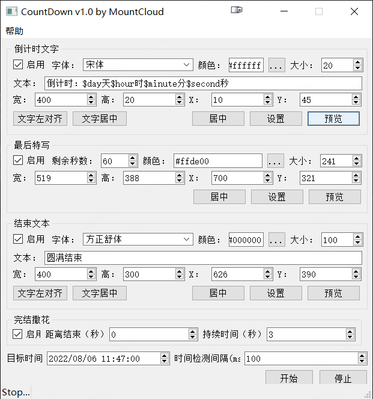
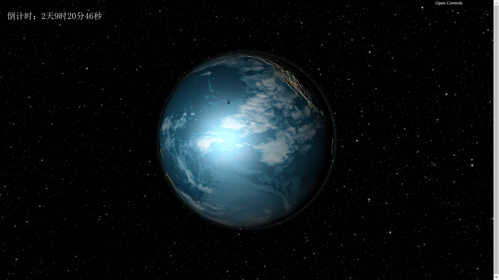
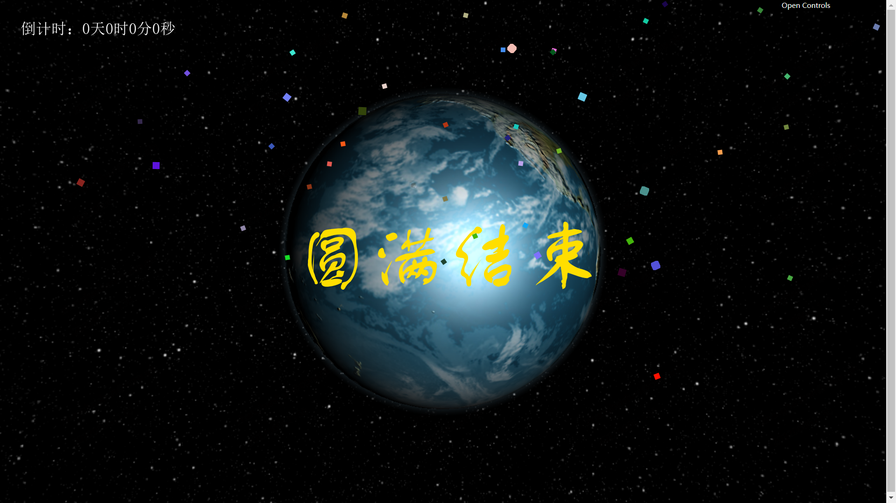

# 简介
连续2年现场的倒计时都翻车了（不是成负数就是又从1开始正数了）。

虽然翻车的都是别人弄得倒计时，但是作为现场的一员总是感觉很遗憾。

今年我决定自己写一个倒计时工具。

# LICENSE

MIT

希望世间无倒计时翻车现场。

# 功能

1.0版本着急写的，使用起来可能不是很舒服，日后再优化，当然你可以进行二次开发。

1：倒计时悬浮，格式：倒计时：$day天$hour时$minute分$second秒。

只要保证占位符对，格式可以自己调整。还可以调整位置、字体、文字大小以及透明的那个看不见的悬浮大小。

2：最后特写时间

如果最后N秒需要在大屏幕中特写，可以显示一个类似LCD的数字倒计时特效，可以改变颜色、大小、位置。

3：结束文字

在倒计时成0的时候可以显示一个文字，比如：圆满结束。

可以调整位置、字体、文字大小以及透明的那个看不见的悬浮大小。

4：结束撒花

见名知意，结束撒花特效，全屏的。

## 功能截图

# 预览
忽略掉大地球背景，只看左上角和屏幕中间的悬浮文字以及撒花特效就行，是在找不下可以用来演示的大屏，找了个地球背景。

## 预览-倒计时（放左上了）

## 预览-最后特写（放到正中了）

## 预览-结束文本+撒花
